  

  

  Hi there! I'm a developer focused on building efficient, automated solutions. I enjoy solving complex backend problems and crafting smooth frontend experiences. My work on <b>SuggestArr</b> showcases my commitment to creating tools that people love and use.

## 🛠️ My Tech Stack

  
  
  
  
  

  
  
  
  

## 📊 GitHub Analytics (Smart & Automated)

  
  

## 🚀 Featured Project

  

## 👋 Connect with me

  
  

