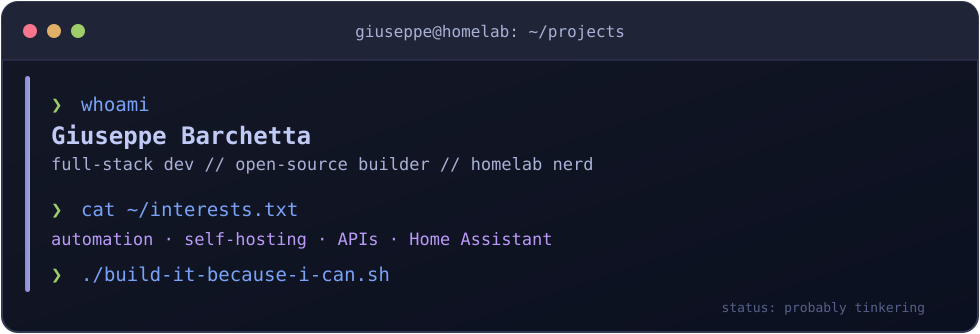

<div align="center">




<!-- Yes, this is a GitHub README. No, I couldn't resist making it look like a terminal. -->

[](https://github.com/giuseppe99barchetta/SuggestArr)
[](https://github.com/giuseppe99barchetta?tab=followers)
[](https://github.com/giuseppe99barchetta?tab=repositories)


**I build things, automate them, then find new things to automate.**

</div>

## `$ whoami`

Hey, I'm **Giuseppe** 👋 — a full-stack developer and incurable tinkerer.

I love the kind of projects that start with *“why doesn't this exist?”* and end with a new repo, a Docker container, and probably a dashboard nobody asked for.

I'm into **backend-heavy apps, polished interfaces, media automation, Home Assistant, APIs, and self-hosted infrastructure**. I like understanding how things work all the way down — not just getting them to work once.

> If it has an API, there's a good chance I'll try to automate it.

## `$ ls ~/projects --featured`

### `./SuggestArr` · [source code →](https://github.com/giuseppe99barchetta/SuggestArr)

**The main quest.** Open-source media discovery and automation for **Jellyfin, Plex, and Emby**, turning watch history into recommendations and requests — with scheduled jobs, a web UI, and optional AI-powered suggestions.

[](https://github.com/giuseppe99barchetta/SuggestArr/stargazers)
[](https://hub.docker.com/r/ciuse99/suggestarr)

### `./MediaFlowrr` · [source code →](https://github.com/giuseppe99barchetta/MediaFlowrr)

**Because messy download folders are a bug.** Uses TMDb metadata to detect, rename, and organize movies and TV shows. Python, scheduled jobs, and Docker.

### `./home_maintenance` · [source code →](https://github.com/giuseppe99barchetta/home_maintenance)

**Yes, I automated chores too.** A Home Assistant integration for recurring maintenance, reminders, history, NFC task completion, and a responsive management panel.

### `./FordConnect-HA` · [source code →](https://github.com/giuseppe99barchetta/FordConnect-HA)

**The car is part of the smart home now.** Home Assistant integration built on Ford's official FordConnect API, with OAuth, vehicle telemetry, and privacy-conscious diagnostics.

<details>
<summary><b>📂 More repos?</b> There's always another side quest.</summary>

<br>

Check out [all my public repositories](https://github.com/giuseppe99barchetta?tab=repositories) — experiments, integrations, bots, utilities, and whatever rabbit hole I'm exploring next.

</details>

## `$ cat ~/.config/stack.yml`

```yaml
languages:      [Python, JavaScript, TypeScript, Java, SQL]
backend:        [FastAPI, Spring Boot, PostgreSQL, Redis]
frontend:       [Vue, React, Next.js]
devops:         [Docker, Linux, GitHub Actions, Proxmox]
automation:     [Home Assistant, MQTT, REST APIs]
debug_strategy: "one more log line"
```

## `$ tree ~/homelab -L 2`

This is where ideas turn into services, experiments turn into automations, and *“I'll just change one setting”* turns into an evening.

```text
homelab/
├── hypervisor/       Proxmox · VMs · LXC · ZFS
├── containers/       Docker · self-hosted services
├── smart-home/       Home Assistant · Zigbee · MQTT
├── media/            Jellyfin · media automation
├── network/          GL.iNet · VPN · reverse proxy
└── reliability/      monitoring · backups · UPS
```

I enjoy connecting systems that weren't designed to talk to each other, learning by running real infrastructure, and making dashboards for absolutely everything.

## `$ git stats --human`

<div align="center">
  
  
</div>

<sub>Repository languages don't tell the whole story — but I still like the graphs.</sub>

## `$ cat ~/currently-running.txt`

```text
[RUNNING] Building open-source tools
[RUNNING] Self-hosting more things than necessary
[RUNNING] Automating tasks that take 30 seconds manually
[RUNNING] Tweaking Home Assistant dashboards
[PENDING]  "Okay, this is the last improvement"
```

---

<div align="center">

**`giuseppe@homelab:~$`** `echo "Thanks for stopping by!"`

[](https://github.com/giuseppe99barchetta)
[](https://www.linkedin.com/in/giuseppe-barchetta)

*Build it. Automate it. Keep it running.*

</div>
